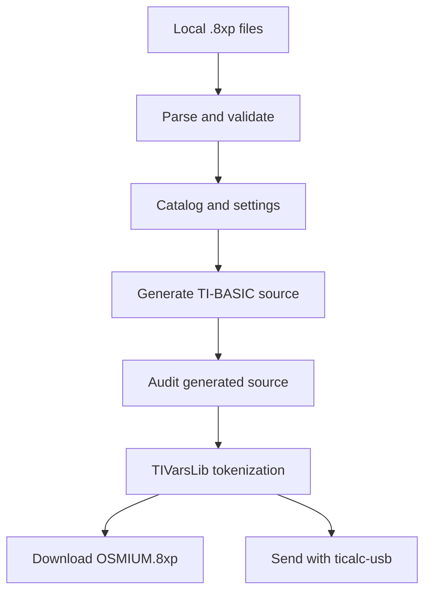

# Architecture

Osmium has two related output paths: it can download calculator files with
ordinary browser APIs, or send them directly with WebUSB. In both cases the
selected source files remain local to the browser.

## Browser application

`app/osmium-builder.tsx` owns the catalog editor, preview, project import/export,
download actions, and WebUSB transfer state. Game binaries are held only in the
current page's memory and are intentionally absent from saved project JSON.

## Generator core

`lib/osmium.ts` parses calculator variable files, rejects recognized native-code
headers, produces the fixed TI-BASIC dispatch program, audits readable source,
and calls the vendored TIVarsLib WebAssembly tokenizer. Keeping these operations
in one module makes the same logic available to browser code, tests, and the
demo build script.

## Calculator runtime

The generated program contains its menu data and launch targets at compile time.
It does not enumerate the calculator variable table. Launches are ordinary
TI-BASIC subprogram calls. A normal end or `Return` resumes Osmium; `Stop` ends
the complete call stack and cannot be intercepted by a pure TI-BASIC caller.

## Transfer path

The browser requests a calculator only after the user selects a send action.
Checked game files preserve their uploaded bytes. `OSMIUM.8xp` is generated at
send time. `ticalc-usb` performs storage checks and WebUSB transfer; no remote
application endpoint receives the file data.

